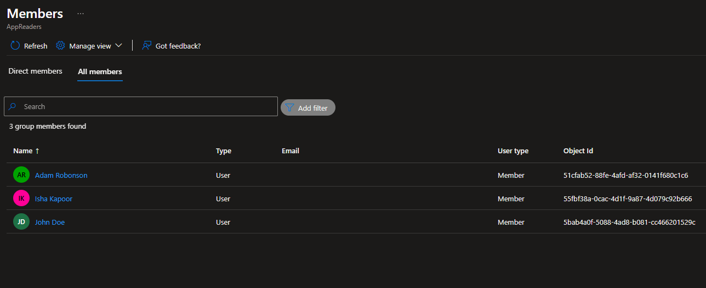
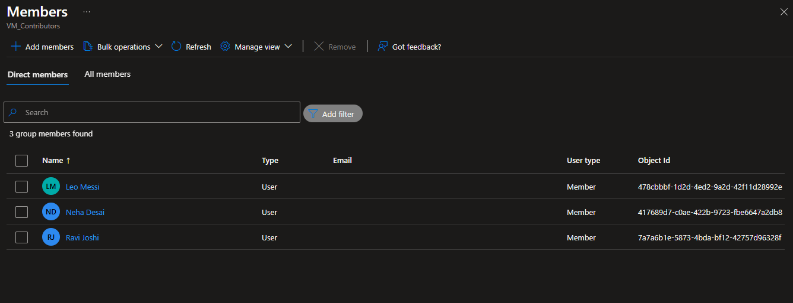
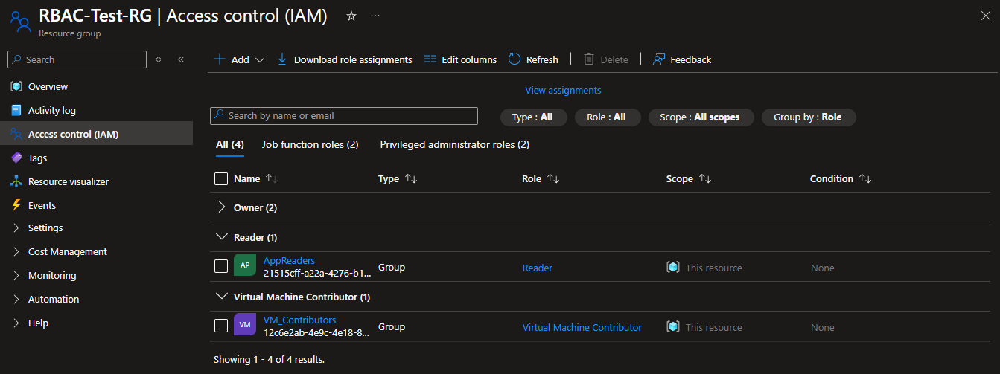

# 🔐 Module: Administer Identity 

This module covers user and group management in Microsoft Entra ID (Azure AD), and role-based access control (RBAC) in Azure.

---

## ✅ Tasks Performed

- Created 6 Azure AD users manually
- Created 2 security groups: `AppReaders` and `VMContributors`
- Added 3 users to each group
- Assigned:
  - **Reader** role to `AppReaders`
  - **Virtual Machine Contributor** role to `VMContributors`
- Attempted login as test users and encountered Microsoft Authenticator prompt
- Understood impact of Security Defaults on MFA behavior

---

## 📸 Screenshots

- 
- 
- 
- 
- 
- 
- 
- 
- 
- 

---

## 🧠 Learnings

- Users and groups in Entra ID are used for identity management only
- Azure resource access is controlled using RBAC, not Entra ID roles
- Assigning RBAC to groups simplifies permission management
- MFA can block test logins due to default security settings

